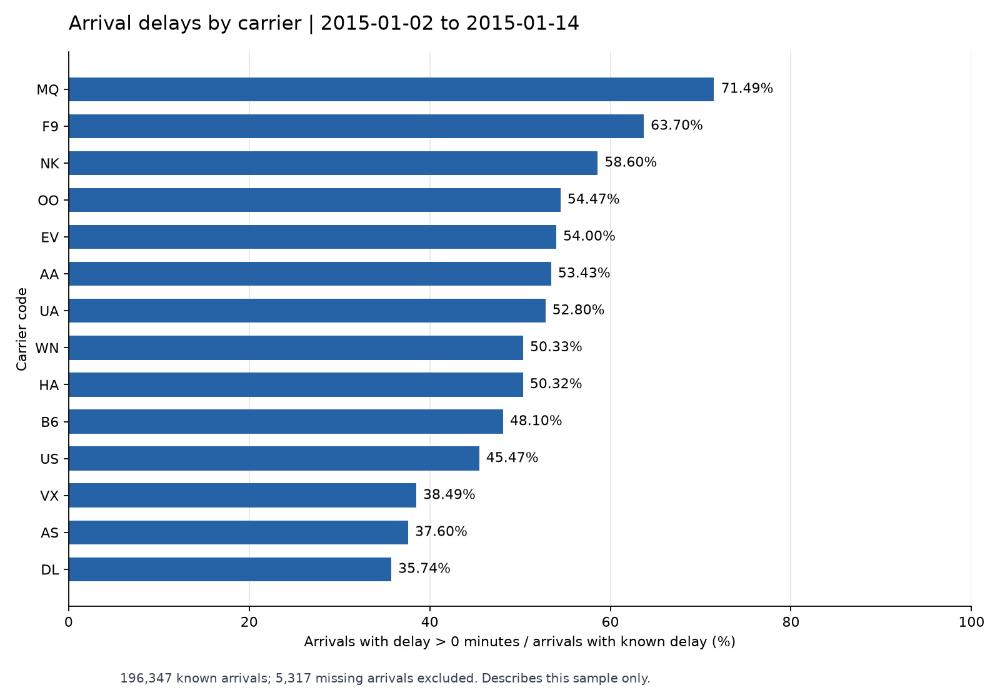
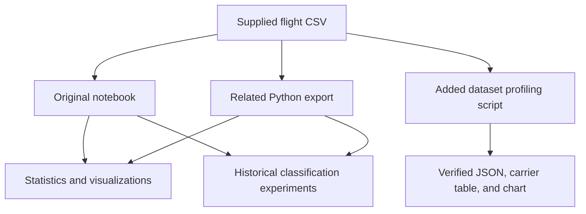

# US Domestic Flight Delay Analysis

An exploratory data analysis and machine learning study of US domestic flight records, combining airline and airport comparisons, descriptive statistics, visualizations, and four classification experiments in Python.

The supplied CSV contains **201,664 flight records**, **14 carriers**, and **312 origin airports**, covering **January 2–14, 2015**. The project investigates how arrival delays vary across carriers, airports, and weekdays, and explores classification of delayed versus non-delayed arrivals.

**Project status:** a historical analytical study with a newly verified dataset summary. The original notebook and Python export are preserved. Their model experiments contain target leakage and execution defects, and the notebook's saved outputs refer to a different-sized dataset. Those outputs are historical evidence, not validated forecasting results. See the [technical review](docs/PROJECT_REVIEW.md) for the findings and repair priorities.

## Explore the project

- [Original analysis notebook](Domestic_Flights_Data_Mining.ipynb) — narrative, source code, and historical saved outputs.
- [Verified dataset profile](docs/results/dataset_profile.json) and [carrier summary](docs/results/carrier_summary.csv) — recomputed from the supplied CSV.
- [Data dictionary](docs/DATA_DICTIONARY.md) — schema, missing values, coverage, and source limitations.
- [Project review](docs/PROJECT_REVIEW.md) — file relationships, implementation details, reproducibility issues, and publication recommendations.
- [CV and portfolio wording](docs/CV_PROJECT_DESCRIPTION.md) — accurate ways to present the work.

## Purpose and objectives

The analysis addresses three questions:

1. How do the volume and proportion of delayed arrivals differ between carriers?
2. How are delays distributed, and how do they vary across origin airports and weekdays?
3. How do decision tree, random forest, logistic regression, and multilayer perceptron classifiers behave on the constructed delay label?

The material demonstrates tabular data exploration, aggregation, statistical interpretation, visualization, and experimentation with classification models. The directory name `prj-sepehran` is the original project label; the supplied material does not establish a connection to Sepehran Airlines or a commercial deployment.

## Implemented analysis

| Area | What the source contains |
| --- | --- |
| Data exploration | CSV loading, shape inspection, missing-value counts, and a binary arrival-delay indicator |
| Carrier comparisons | Delayed-flight counts, proportions, mean delays, and comparisons of WN, US, and MQ |
| Descriptive statistics | Mean, median, quantiles, standard deviation, histograms, box plots, and density plots |
| Airport analysis | The 20 busiest origins by record count; daily mean arrival delays by airport; delayed-flight counts after complete-case filtering |
| Temporal analysis | Conversion of flight dates to weekdays and aggregation of delayed-flight counts |
| Relationships | Scatter plots and Pearson correlation heatmaps |
| Preprocessing | Integer-truncated mean imputation and a fixed mapping of 14 carrier codes to integers |
| Classification experiments | Decision tree, random forest, logistic regression, and a scikit-learn neural network |
| Evaluation code | Custom confusion matrices, accuracy/error calculations, and comparison charts; metric naming needs correction |
| Tree visualization | Graphviz rendering in the notebook; disabled in the Python export |

SVM code is commented out. An IQR outlier function is defined but never called. ROC plotting is unfinished and references undefined variables. These are not completed features.

## Verified dataset findings

These figures were recomputed from the current CSV by [the profiling script](scripts/profile_dataset.py). Missing arrival delays are excluded from the observed-arrival delay rate.

| Measure | Verified value |
| --- | ---: |
| Flight records | 201,664 |
| CSV columns | 15, including an exported row index |
| Coverage | January 2–14, 2015; 13 distinct dates |
| Carriers | 14 |
| Origin / destination airports | 312 / 312 |
| Distinct directional origin–destination pairs | 4,152 |
| Records with known arrival delay | 196,347 |
| Arrivals later than scheduled (`arr_delay > 0`) | 98,627 |
| Delay rate among known arrivals | 50.23% |
| Mean / median arrival delay among known values | 13.93 / 1.00 minutes |
| Records marked cancelled | 4,791 |
| Missing arrival delays | 5,317 |



Southwest (`WN`) has the largest number of delayed arrivals in this sample: **21,150**. Envoy (`MQ`) has the highest proportion among records with known arrival delay: **71.49%**. These describe the supplied 13-day sample; they do not establish long-term airline performance or travel recommendations.

The original code counts missing arrival delays as `False` when it constructs `delayed`. Its all-record denominator therefore gives **48.91%**, rather than the **50.23%** observed-arrival rate above. The generated carrier summary includes both definitions explicitly.

## Technologies and tools

- **Python** — analysis and orchestration.
- **pandas and NumPy** — tabular processing, aggregations, and numerical operations.
- **Matplotlib and Seaborn** — statistical plots and evaluation charts.
- **Plotly Express** — interactive carrier, airport, and weekday charts.
- **scikit-learn** — train/test splitting, classifiers, and evaluation utilities.
- **Graphviz** — notebook tree diagrams; requires both the Python package and the system `dot` executable.
- **Jupyter / Google Colab** — notebook workflow; the saved notebook contains Colab metadata and Python 3.8 runtime paths.

SciPy is imported by the original source, but its imported `norm` object is unused. JupyterLab, nbformat, and nbconvert support inspection and rendering in the documented review environment. The repository does not contain an application server, database, web interface, deployment configuration, trained model artifact, or external-service integration.

## Repository structure and component relationships

```text
prj-sepehran/
├── README.md
├── Domestic_Flights_Data_Mining.ipynb       # Renderable copy of the original notebook
├── Domestic_Flights_Data_Mining.ipynb.txt   # Original notebook JSON; retained locally, Git-ignored
├── domestic_flights_data_mining_ipynb_txt.py # Closely related Python export
├── transport_data_2015_january.csv         # Shared input for both original analysis files
├── requirements.txt                       # Pinned review/profiling environment
├── .gitignore
├── scripts/
│   └── profile_dataset.py                  # Added reproducible descriptive-data check
└── docs/
    ├── PROJECT_REVIEW.md
    ├── DATA_DICTIONARY.md
    ├── CV_PROJECT_DESCRIPTION.md
    └── results/
        ├── dataset_profile.json
        ├── carrier_summary.csv
        └── carrier_delay_rates.png
```

All three original files belong to the same project. The notebook and script load the same CSV by its relative filename and share the same analytical and modeling logic. The notebook additionally contains narrative cells, saved results, and active Graphviz sections; the script disables some of those imports and diagrams. There is no evidence of a separate unrelated project inside this directory.

The `.ipynb` file is a byte-for-byte copy of `.ipynb.txt`, added so notebook tools and GitHub can recognize the format. It retains the original historical outputs and errors. The files under `docs/` and `scripts/`, along with the dependency manifest and ignore rules, were added during the repository review; they are not claimed as original project components.



## How the original workflow works

1. Load the CSV into a pandas DataFrame.
2. Create `delayed = arr_delay > 0` before filling missing values.
3. Produce descriptive statistics and visualizations by carrier, origin airport, and weekday.
4. Fill seven numeric columns with the integer part of their whole-dataset mean and encode carrier codes as integers.
5. Drop `flight_date`, `origin`, and `dest`, then select predictors and the target by column position.
6. Split records into 75% training and 25% test sets, without a fixed split seed or stratification.
7. Fit four classifiers and calculate comparison metrics.
8. Attempt confusion-matrix and ROC visualizations, subject to the documented runtime defects.

The ten selected predictors are:

```text
unique_carrier, flight_num, arr_delay, cancelled, distance,
carrier_delay, weather_delay, late_aircraft_delay, nas_delay, security_delay
```

The target is `delayed`. Including `arr_delay` directly exposes the rule used to construct the target. Delay-cause measurements are also retrospective information. This setup cannot support a claim of reliable pre-flight delay prediction.

## Installation and setup

The review and profiling workflow was tested with **Python 3.13.15**. Exact direct dependency versions are recorded in [requirements.txt](requirements.txt). This is a newly verified environment, not a reconstruction of the unknown original environment.

From the repository root on Linux or macOS:

```bash
python3.13 -m venv .venv
source .venv/bin/activate
python -m pip install -r requirements.txt
```

No API keys, credentials, database, or `.env` file are required. Keep the CSV beside the original notebook and script because their `pd.read_csv(...)` call resolves the filename against the working directory.

Installing these packages enables the new profiling workflow and notebook inspection. It does **not** fix the preserved notebook's removed APIs, undefined ROC variables, or methodological problems.

## Usage

### Reproduce the verified summary

```bash
python scripts/profile_dataset.py
```

Expected console summary:

```text
Records: 201,664; known arrival delays: 196,347
Date coverage: 2015-01-02 to 2015-01-14
Delayed among known arrivals: 50.23%
```

The command creates or refreshes `docs/results/dataset_profile.json`, `carrier_summary.csv`, and `carrier_delay_rates.png`. It reads the CSV without changing it and does not train any classifiers.

To choose a different output location:

```bash
python scripts/profile_dataset.py --output-dir local-exports/profile
```

The script also accepts `--data PATH` for a CSV with the same schema. Its default paths are resolved from the script location, so it can be invoked from outside the repository. Custom relative paths are resolved from the current working directory.

### Inspect the original notebook

```bash
jupyter lab Domestic_Flights_Data_Mining.ipynb
```

Use the notebook to read the original narrative, code, and saved outputs. A fresh **Run All is not expected to succeed** with the current source. In the tested environment, the notebook stops while importing the removed `plot_confusion_matrix` function. The Python export gets past that import but retains other failures. See [execution findings and migration guidance](docs/PROJECT_REVIEW.md#execution-and-compatibility-findings).

Tree rendering additionally needs Graphviz's system `dot` executable. The Python `graphviz` package alone does not supply it; install the Graphviz system package if you choose to repair and execute those cells. The dataset profiling script does not need `dot`.

For a local static HTML copy of the historical notebook, without executing it:

```bash
jupyter nbconvert --to html --output-dir local-exports Domestic_Flights_Data_Mining.ipynb
```

Saved Plotly content can depend on external JavaScript/CDN resources and may not behave like a live interactive notebook in static viewers. The verified README chart is a standalone PNG.

## Results and limitations

The dependable current outputs are the descriptive dataset profile and carrier chart above. The historical notebook stores approximately **99.72% decision-tree**, **99.65% random-forest**, **99.72% logistic-regression**, and **92.88% neural-network** accuracy. These must not be used as predictive-performance claims: the features leak the target, and the saved outputs describe **182,940 rows**, not the **201,664 rows** in the supplied CSV.

Additional limitations include missing labels treated as non-delays, whole-dataset imputation before splitting, arbitrary integer encoding, no feature scaling for linear/neural models, incorrect sensitivity/specificity labels, no cross-validation, and an incomplete ROC section. Weekday counts cover unequal numbers of dates, and the airport count chart drops every incomplete record before counting. The [review](docs/PROJECT_REVIEW.md) explains each issue and its effect.

## Future improvements

1. Repair the legacy imports, plotting calls, chained assignments, and ROC calculations, then execute the notebook from a clean kernel.
2. Exclude unknown arrival outcomes from supervised labels and define a clear cancellation policy.
3. Choose the intended prediction time and remove arrival delay and other unavailable outcome information from the features.
4. Fit imputation, encoding, and scaling only on training data using a pipeline; select columns by name.
5. Establish a baseline, fixed random seeds, and appropriate temporal validation before reporting model performance.
6. Recalculate correctly labeled precision, recall, specificity, F1, and ROC-AUC; preserve the resulting environment and dataset checksum.
7. Normalize weekday and airport comparisons, revise unsupported statistical interpretations, and broaden the date coverage if suitable data becomes available.

These are proposed improvements, not existing functionality.

## Data source, attribution, and publication

The original notebook links to [Domestic Flights Data Scrape on Kaggle](https://www.kaggle.com/datasets/vishwanathmuthuraman/domestic-flight-data). That link is the recorded source attribution; the repository does not include the acquisition script, original download metadata, or a verified dataset license. The local file's exact relationship to a particular upstream version is unconfirmed.

No code license or authorship statement was supplied. Before publishing, confirm code authorship, add appropriate acknowledgments, choose a code license you are entitled to grant, and verify the dataset's redistribution conditions. A code license would not automatically license the dataset. If redistribution is not permitted, publish authorized acquisition instructions instead of the CSV. No original files were removed as part of this documentation review.
